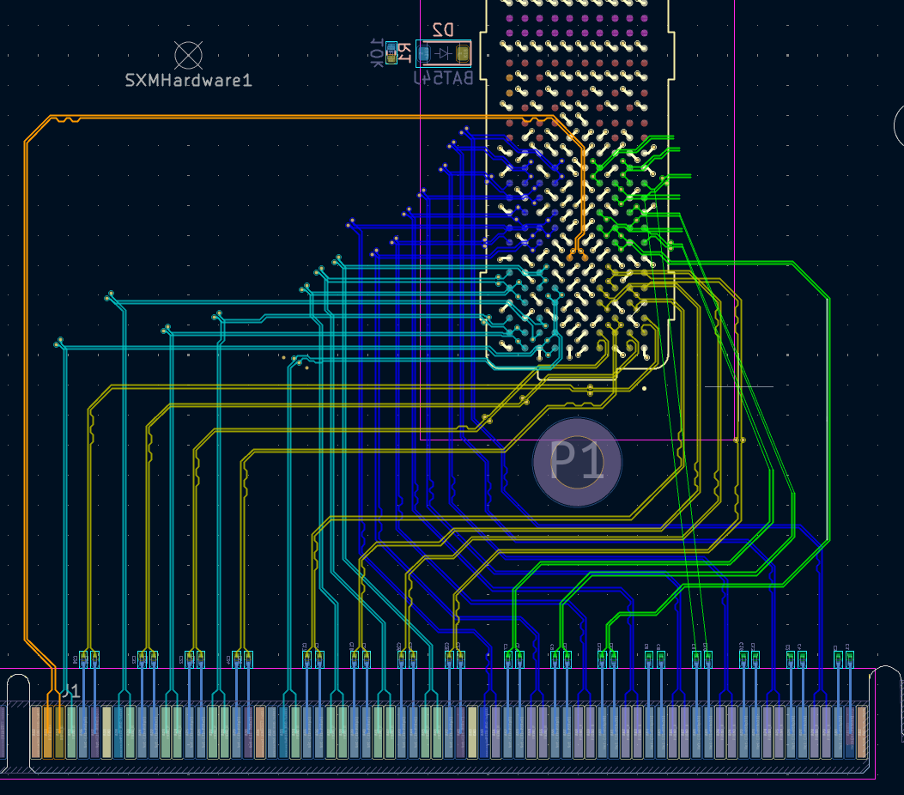

# SXM2-PCIe-adapter

This project builds on [preliminary work](http://github.com/bbenchoff/SXM2toPCIe) by Brian Benchoff
to set up an open-hardware SXM2 to PCIe adapter module.

# Status
Board setup and impedance calculations are done. Differential pairs routing nearly finished:

# Todo list
 - [x] Set up PCB stackup consistent with JLCPCB 4-layer impedance-controlled options
 - [ ] Route differential pairs
 - [ ] Place ground vias / stitching
 - [ ] Add 12V 2x6 power management, routed into SXM directly
 - [ ] Place needed screw holes for heat sink and fan
